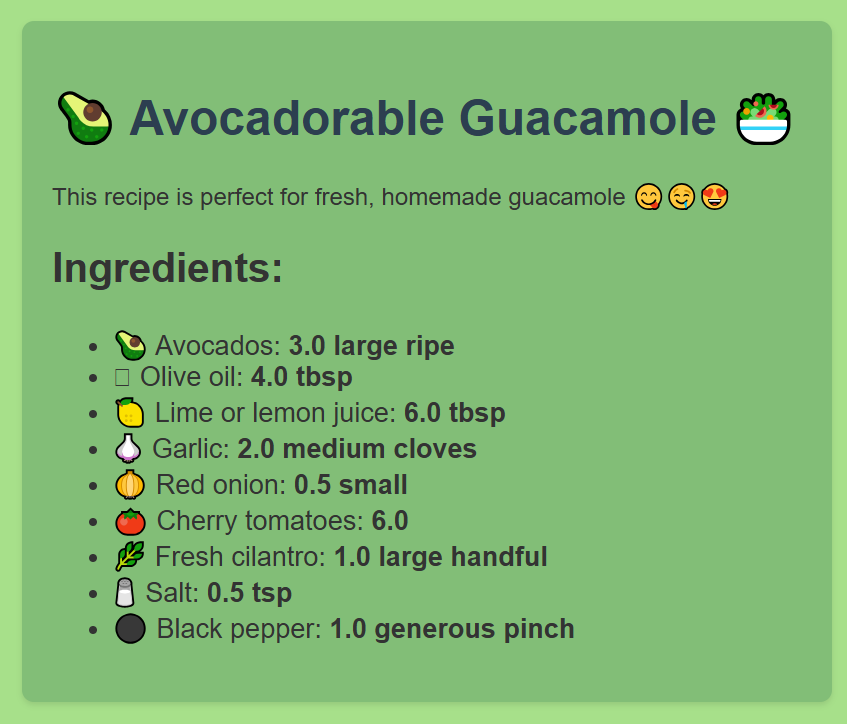
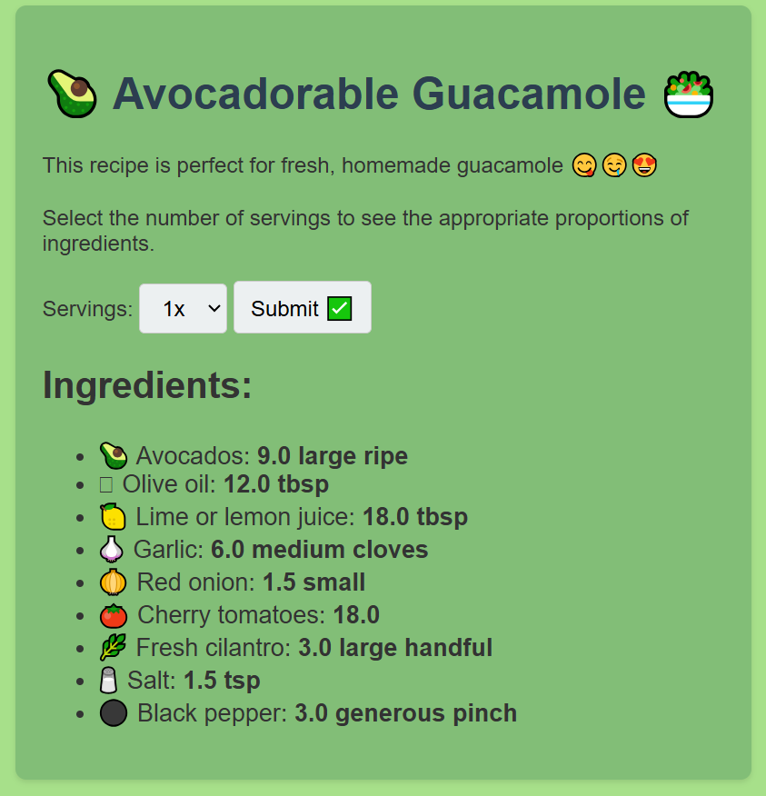

# 🥑 GuacFeatureFlag 🥑

Welcome to **GuacFeatureFlag**, the most _delicious_ way to demonstrate feature flags! This project blends the creamy smoothness of avocados with the crisp functionality of feature toggles to bring you a tasty tech demo. If you've ever wanted your code to be as adaptable as guacamole at a party, you're in the right place!

## 🧩 What Are Feature Flags?

A feature flag is a software development tool used to safely activate or deactivate features without modifying the source code or performing a new deployment. It’s the software world’s equivalent of adding cilantro to only half the guac because your weird cousin hates it. 🌱

Feature flags are typically used in conditional statements (e.g., if-else) to determine which code path will be executed. Traditionally, feature flags return a boolean value: true or false. 

Here’s what feature flags can do for your app (and your stress levels):

* **Experiment Safely**: Test in production without throwing all the chips in at once.
* **Progressive Rollouts**: Monitor performance and feedback before a full release - add features bit by bit, like taste-testing before serving the guac to the crowd.
* **Easy Reversals**: Accidentally make it too spicy? Roll back without needing a whole new batch of code.

In short, feature flags are your secret ingredient for smoother launches, happier users, and less developer heartburn.

## 📋 Features

* **Dynamic Ingredients Scaling**: Adjust the guacamole recipe for 1 to 4 servings (or just eat it all yourself—no judgment).
* **Feature Flag Demo**: Learn how feature flags work using our recipe as an example. Add cilantro? Toggle it! Extra chili? Done!
* **Minimalist Setup**: Built using Flask and plain HTML—no fancy JavaScript frameworks, just simple and tasty code.


**Simple application displaying a recipe**:



**More 'sophisticated' application displaying a recipe and allowing dynamically ingredients scaling**:



## 🚀 How to Get Started

1. Clone this repo:

    ```bash
    git clone https://github.com/dorota-ostrowska/GuacFeatureFlag.git
    cd GuacFeatureFlag
    ```

2. Set up your environment:

    ```bash
    python -m venv venv
    source venv/bin/activate
    pip install -r requirements.txt
    ```

3. Run the app:

    ```bash
    python main.py
    ```

4. Navigate to http://127.0.0.1:5000/ and enjoy your digital guacamole experience.

## 👩‍🍳 Recipe for Success

Remember, the secret to great guacamole (and great code) is balance:

* 🧂 Too much salt and you ruin the guac.
* 🇲🇽 Too many flags and you ruin the codebase.

Stay balanced, stay fresh, and always taste-test your features before serving!
