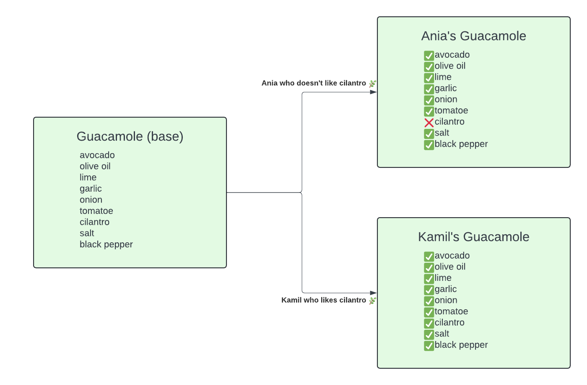
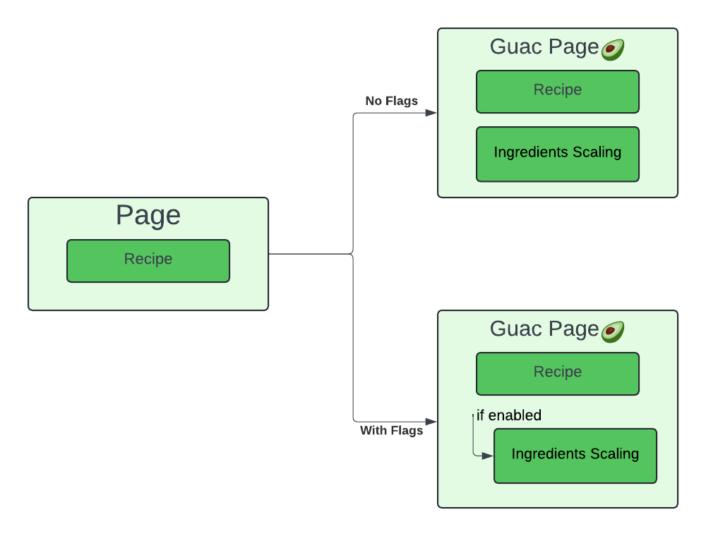

# 🥑 GuacFeatureFlag 🥑

Welcome to **GuacFeatureFlag**, the most _delicious_ way to demonstrate feature flags! This project blends the creamy smoothness of avocados with the crisp functionality of feature toggles to bring you a tasty tech demo. If you've ever wanted your code to be as adaptable as guacamole at a party, you're in the right place!

## 🧩 What Are Feature Flags?

A feature flag is a software development tool used to safely activate or deactivate features without modifying the source code or performing a new deployment.

Feature flags are typically used in conditional statements (e.g., if-else) to determine which code path will be executed.

Think of it like adding ingredients to your guacamole:

* You can add cilantro or skip it entirely, depending on who’s eating.
* You don’t need to remake the entire guac (or redeploy your app) to make this adjustment.

    

    pseudocode:

    ```Python
    Ania(Eater):
        likes_cilantro: bool = False

    Kamil(Eater):
        likes_cilantro: bool = True
    ```

    ```Python
    if user.likes_cilantro:
        show_cilantro_in_recipe()
    ```

### Why Feature Flags?

Their true power lies in the ability to:

* Decide at runtime which functionality is executed.
* Customize decisions at the user or request level, not just globally.

This allows you to:

* Safely experiment in production.
* Monitor performance and feedback before a full release.
* Roll out features progressively to avoid unexpected "spicy surprises" in your application. 🌶️

Just like the perfect guac recipe, feature flags allow you to experiment, adjust, and serve up only what works best.

## 📋 Features

* **Dynamic Ingredients Scaling**: Adjust the guacamole recipe for 1 to 4 servings (or just eat it all yourself—no judgment).
* **Feature Flag Demo**: Learn how feature flags work using our recipe as an example. Add cilantro? Toggle it! Extra chili? Done!
* **Minimalist Setup**: Built using Flask and plain HTML—no fancy JavaScript frameworks, just simple and tasty code.
  
  

## 🚀 How to Get Started

1. Clone this repo:

    ```bash
    git clone https://github.com/dorota-ostrowska/GuacFeatureFlag.git
    cd GuacFeatureFlag
    ```

2. Set up your environment:

    ```bash
    python -m venv venv
    source venv/bin/activate
    pip install -r requirements.txt
    ```

3. Run the app:

    ```bash
    python main.py
    ```

4. Navigate to http://127.0.0.1:5000/ and enjoy your digital guacamole experience.

## 👩‍🍳 Recipe for Success

Remember, the secret to great guacamole (and great code) is balance:

* 🧂 Too much salt and you ruin the guac.
* 🇲🇽 Too many flags and you ruin the codebase.

Stay balanced, stay fresh, and always taste-test your features before serving!
